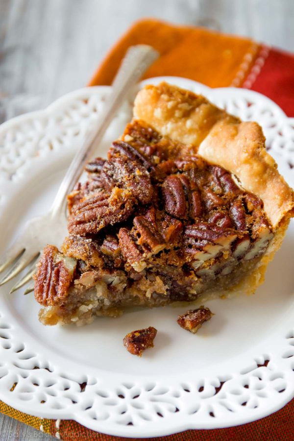

# Sally's favorite pecan pie recipe
[Link to website](https://sallysbakingaddiction.com/my-favorite-pecan-pie-recipe/#tasty-recipes-71034)

## Filling
- 2 and 1/2 cups (250g) shelled pecans (pecan halves)
- 3 large eggs
- 1 cup (240ml) dark corn syrup*
- 1/2 cup (100g) packed light or dark brown sugar
- 1 and 1/2 teaspoons pure vanilla extract
- 1/4 cup (60g) unsalted butter, melted and slightly cooled
- 1/2 teaspoon salt
- 1/2 teaspoon ground cinnamon

## Instructions

1. Adjust oven rack to the lower third position and preheat to 350°F (177°C).
2. Roll out the chilled pie crust onto a lightly floured surface. Remember, when rolling out the pie dough, always use gentle force with your rolling pin. Start from the center and work your way out in all directions, rotating the dough with your hands as you go. Roll it out into a circle 12 inches in diameter. Carefully place the dough in a 9×2 inch pie dish. Tuck it in with your fingers, making sure it’s smooth. For a beautiful edge, as shown in the video above, fold the overhanging dough back over the edge and use your hands to mold the edge into a nice thick rim around the pie. Crimp the edges with a fork or use your fingers to flute the edges. Again, you can see me do this in the video above. Brush the edges with egg wash. (To help guarantee a beautiful edge, I always chill the shaped dough in the pie dish for 10 minutes in the refrigerator or freezer before filling.)
3. The filling: Very roughly chop the pecans– some whole, some lightly chopped is fine. Spread pecans evenly inside pie crust. Whisk the eggs, corn syrup, brown sugar, vanilla, melted butter, salt, and cinnamon together in a large bowl until combined. Pour over pecans.
4. Bake the pie for 50-55 minutes or until the top is lightly browned. After the first 20 minutes of bake time, I place a pie crust shield on top of the pie to prevent the edges from browning too quickly. You can also tent a piece of aluminum foil over the whole pie if it is browning too quickly. Remove finished pie from the oven and place on a wire rack to cool completely. The pie filling will settle as it cools.
5. Slice and serve pie warm or at room temperature. Top with whipped cream or ice cream.